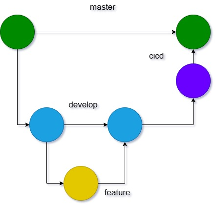

# CICD

Este documento contiene el paso a paso necesario para la solicitud de despliegue en ambiente DEV.

Actualmente

## 1. Pull Request

Todo cambio debe ser solicitado integrar a traves de un _Pull Request_ a nuestro branch principal de desarrollo `develop`

El PR debe estar lo mejor documentado posible.

## 2. Aprobación de Pull Request

Para aprobar ( e integrar ) el PR, deben cumplirse las siguientes 2 actividades.

### Verificar cambios

El _reviewer_ debe verificar que los cambios satisfagan el requerimiento ó defecto a corregir. El cambio debe estar alineado a los estándares definidos por el equipo.

En caso de ser necesario, descargar el _source branch_ al local, para verificar los cambios.

### Correr pruebas unitarias

El _reviewer_ debe correr las pruebas unitarias, para asegurar que no existe algun error de _runtime_ no detectado a tiempo, asi como el porcentaje de pruebas no baje de 90%.

Se puede hacer uso del siguiente comando:

`ng test --no-watch --code-coverage`

---

*Importante:* subir la _versión manual_ que está en el archivo `app.component.ts` y en `package.json` para que se pueda generar el _build_.

Para el versionado, se usa [Versionado Semántico](https://semver.org/lang/es/)

## 3. PR a CICD

Se debe generar un PR:

1. source branch: `develop`
2. target branch: `cicd`

Títuo: cicd to [version]

Descripción: Agregar todos los cambios y _bug fixes_ que se integraron previamente en el _branch_ `develop`.

Una vez creado, darle una revisada final a los cambios y aprobar/integrar los cambios.

---

**Importante:** Para evitar conflictos en integraciones posteriores, se debe actualizar el _branch_ `develop` con el último _commit_ hecho en el _branch_ `cicd`.

1. `git checkout develop`
2. `git pull origin develop`
3. `git pull origin cicd`
4. `git push origin develop`

## 4. Notificación

Como pasos finales, anotar la version en el archivo .xlsx donde se lleva el seguimiento de las versiones desplegadas/solicitadas.

También se debe notificar via email a las personas interesasas en esta solicitud de despliegue a ambiente DEV.

El correo de contener:

1. Versión a desplegar.
2. Lista de cambios.
3. Link commit del merge a CICD.
